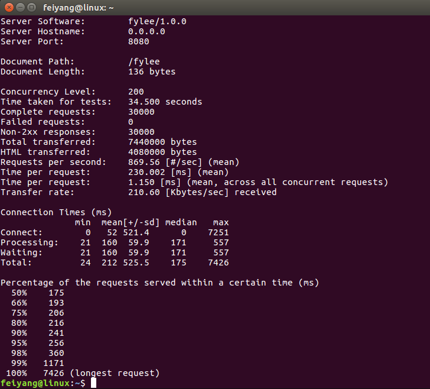
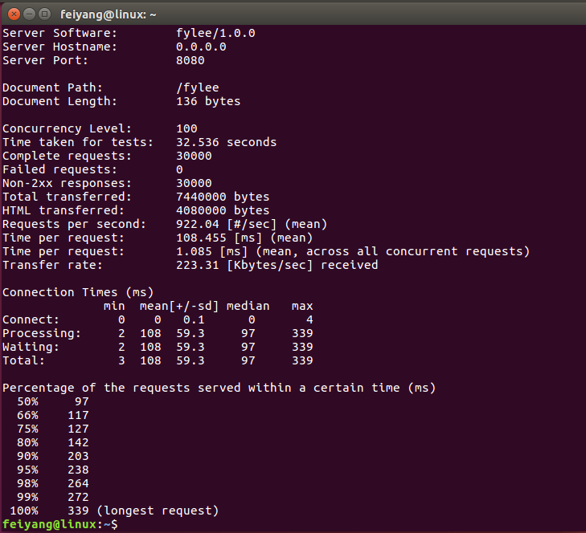
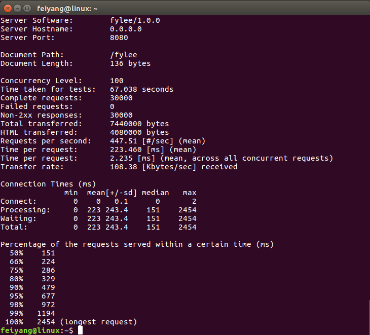

# A simple http server

## Introduction  

基于C++11开发的简易http服务器，实现了日志、线程、同步、scoket、定时器、TCP连接、http解析等功能，核心是Reactor线程模型。


## Envoirment  
* OS: Ubuntu 16.04
* Complier: g++ 7.4.0

## Dependence
[yamp-cpp](https://github.com/jbeder/yaml-cpp)
```
mkdir build && cd build && cmake … && make install
```
## Build
```
./build.sh or ./rebuild.sh
```

## Run
```
./bin/echo_server or ./bin/http_server
```
## Key technologies
* 采用Reactor线程模型即事件循环One loop per thread
* 使用线程池处理TCP连接
* 采用管道pipe(2)实现异步唤醒线程
* 采用epoll ET模式作为IO复用方式
* 基于红黑树即STL set设计定时器
* 使用ragel状态机解析http请求
* 基于回调技术实现servlet容器
* 尽可能使用智能指针，以对象管理资源
 
## stress testing

1. 安装ab压测工具
```
sudo apt-get install apache2-utils
```
2. 运行服务器
```
./http_server
```
3. 输入压力测试命令
```
ab -n 30000 -c 200 http://ipaddr:port/
```
4. 压测结果

单线程测试



2线程测试



4线程测试  

